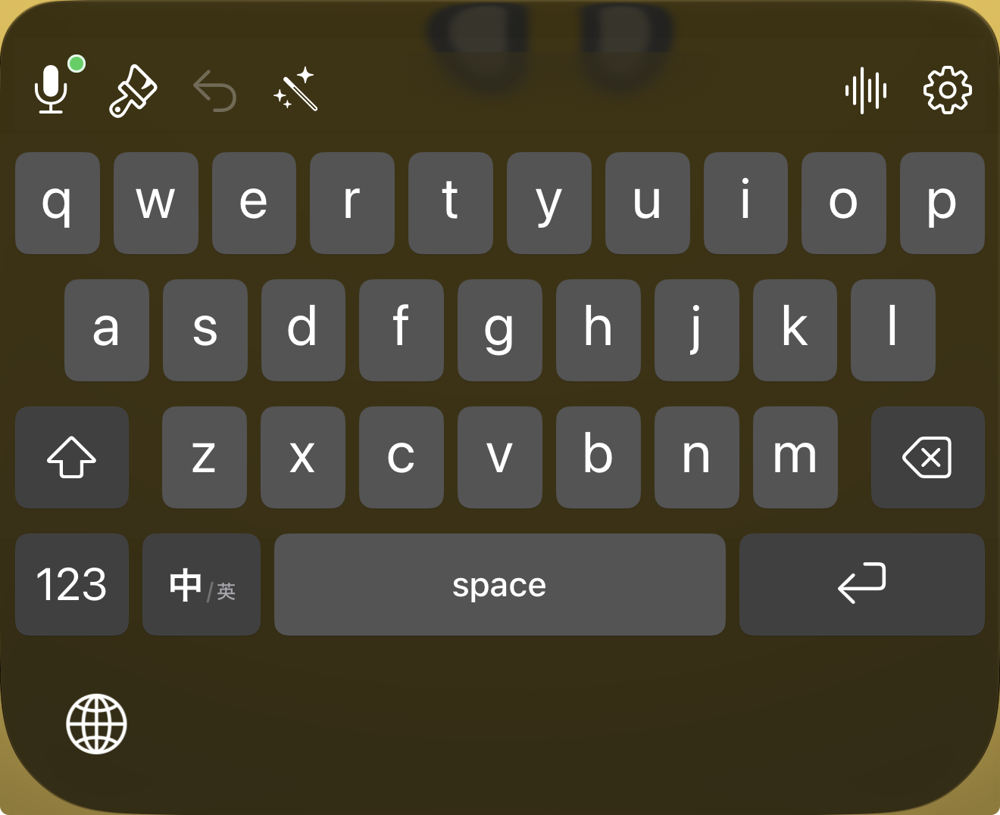
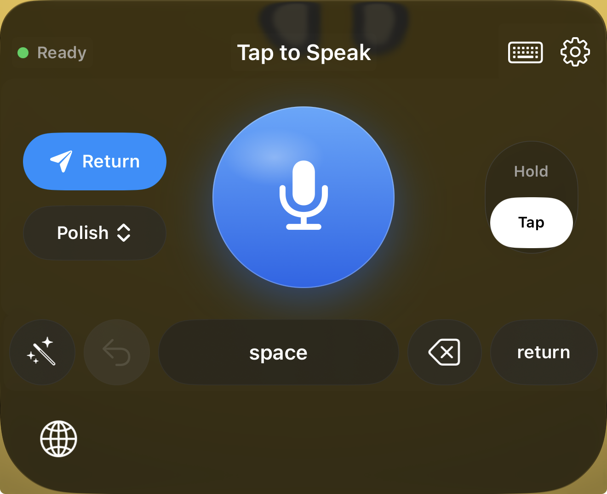
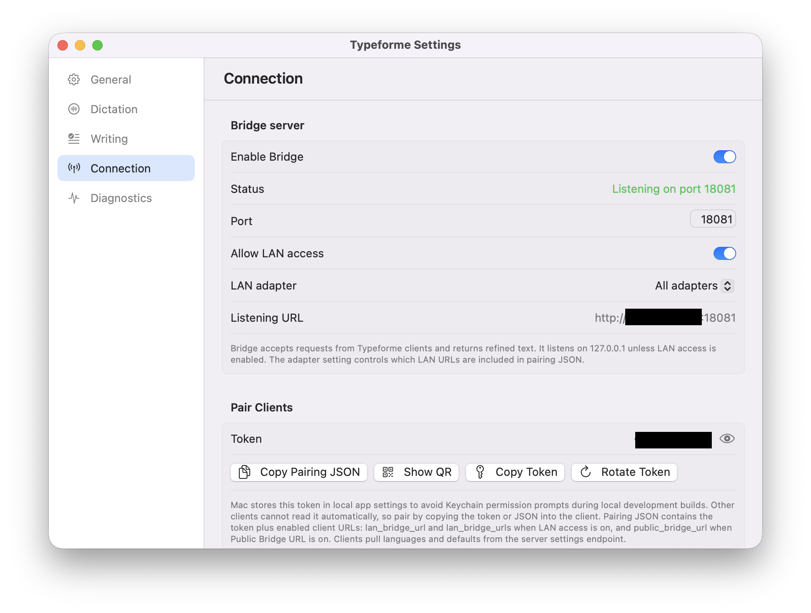
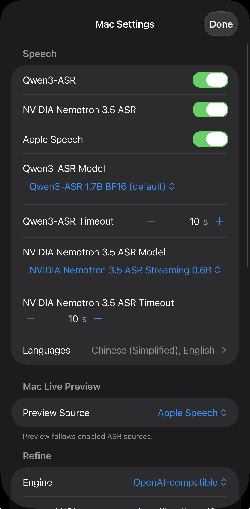
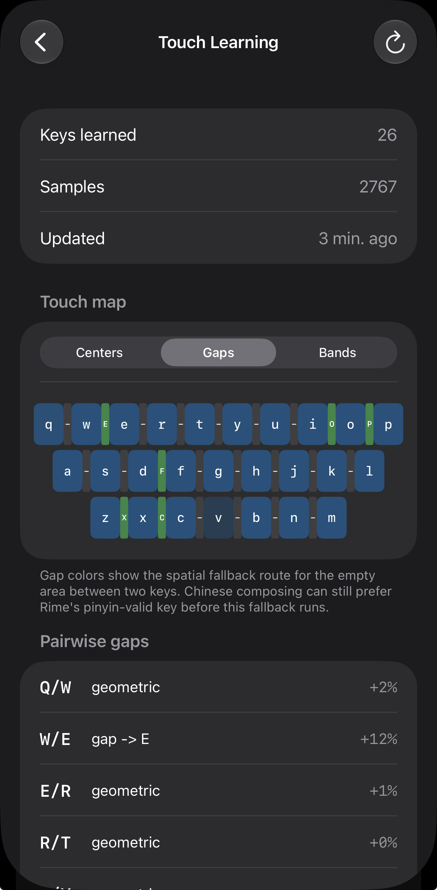

# Typeforme

Typeforme is a local-first voice typing and text refinement tool for macOS and iOS. The Mac app can run as a Server or a Client. Server mode owns local recording, speech recognition, text refinement, and the Bridge service. Client mode records on this Mac, sends audio to another Typeforme Bridge, then inserts the returned text locally.

The iOS host app and keyboard extension use a paired Mac Server for final transcript and refinement on iPhone. In Server mode, Typeforme prefers local models by default, while refinement can also use a user-configured OpenAI-compatible or Anthropic-compatible endpoint.

## Features

- Mac roles: Server for local ASR/refinement/Bridge, or Client for sending audio to another Mac Bridge.
- Speech recognition sources: Qwen3-ASR GGUF, NVIDIA Nemotron 3.5 ASR, and Apple Speech. Enabled sources run independently when they support the selected languages.
- Text refinement engines: local Qwen3.5 2B/4B/9B GGUF through llama.cpp, OpenAI-compatible endpoints, or Anthropic-compatible endpoints.
- Output modes: Clean, Polish, Polish+, Structure+, and Formal+.
- Dictation triggers: global shortcut, double-tap-and-hold modifier key, and iOS keyboard controls.
- Text commit: macOS inserts text via Accessibility by default; the clipboard is only a manual fallback.
- Selection editing: dictate a repair for the current selection, or speak a command for the selected text or focused field.
- Live Preview: Apple Speech or NVIDIA Nemotron can show partial text while recording when the source is enabled.
- User vocabulary: feeds refinement context and can sync to iOS pinyin candidates.
- iOS keyboard: English and Simplified Chinese input; Chinese input is built on Rime pinyin with typo correction, touch learning, Chinese learning data, and user vocabulary support.
- Bridge API: lets iOS and Mac clients pair with a Mac Server, pull settings, upload audio, stream job status, use live preview, refine text, and request text edits.

## Screenshots

| iOS keyboard | iOS dictation |
| --- | --- |
|  |  |
| Full keyboard with dictation, polish, undo, and settings shortcuts. | Tap-to-speak dictation controls. iOS transcript and refinement require a paired Mac running Typeforme in Server mode with Bridge enabled. |

| Mac Bridge settings |
| --- |
|  |
| Enable the Mac Bridge server, allow LAN access, and copy or scan pairing details for iOS clients. |

| Mac settings | Touch learning |
| --- | --- |
|  |  |
| Speech provider, model, timeout, language, preview, and refinement settings. | Learned keyboard touch map with per-key and gap routing statistics. |

## How It Works

Mac Server mode records audio, runs the enabled ASR sources, refines the selected transcript, and either inserts text locally or returns it to Bridge clients. Server mode is also where local model downloads, ASR settings, refinement settings, prompts, diagnostics, and Bridge pairing live.

Mac Client mode records temporary audio locally and sends it to the configured Typeforme Bridge. Requests try Local Bridge URLs first and can fall back to a configured public Bridge URL. The remote Mac Server owns transcription and refinement; the client inserts the result on the local Mac.

iOS dictation is host-owned. The keyboard extension talks to the iOS host app, and the host app sends final dictation work to the paired Mac Server. The keyboard may show local UI state and optional preview, but final transcript and refinement require a reachable Mac Server with Bridge enabled.

## Audio And Privacy

- Mac and iOS record temporary M4A / AAC files.
- Server-mode local recordings go into the enabled local ASR and refinement pipeline.
- iOS and Mac clients upload temporary audio to the user-paired Mac Bridge; iOS transcript and refinement require the paired Mac Server to be reachable.
- The server transcodes audio to 16 kHz mono WAV before ASR when a provider requires it.
- Normal logs avoid raw user text. With Debug mode enabled, audio and processing results are written to the local `DebugCaptures/` folder for troubleshooting.
- Network access comes from model downloads, the user-configured Mac Bridge, and any user-configured external refinement endpoint.

## Requirements

- macOS 14+, Apple Silicon.
- Xcode, to build the macOS app, iOS app, and keyboard extension.
- Microphone permission.
- macOS Accessibility permission, for automatic text insertion.
- iOS 17+; the keyboard extension needs Full Access.
- For local Qwen3-ASR and Qwen3.5 refinement: a llama.cpp build containing `llama-server`.
- For NVIDIA Nemotron ASR: Rust / Cargo to build the local helper.
- For the iOS keyboard: LibrimeKit in `vendor/LibrimeKit` and built Rime data.
- Local Qwen3.5, Qwen3-ASR, and NVIDIA Nemotron ASR need significant memory and disk; on smaller machines start with the smaller models.

## Quick Start

Prepare optional local macOS runtimes before using local Qwen models or NVIDIA Nemotron ASR:

```sh
scripts/vendor-llama.sh <path-to-llama.cpp/build/bin>
scripts/build-nvidia-nemotron-helper.sh
```

macOS build profiles are intentionally separate:

- `dev`: local debug app installed and launched from `dist/mac/dev/`.
- `release`: Developer ID app in `dist/mac/release/`, notarized, stapled, and zipped.
- `github-release`: self-signed app in `dist/mac/github-release/` for GitHub
  artifacts that should not expose Apple Developer identity metadata.

Routine app updates increment only the build number: `CFBundleVersion` on
macOS and `CURRENT_PROJECT_VERSION` on iOS. Marketing versions stay fixed
unless a marketing-version change is explicitly requested. The iOS host and
keyboard extension both use `MARKETING_VERSION = 0.1.523` and must remain in
lockstep.

Build, install, and launch the local debug app:

```sh
scripts/run-mac-debug.sh
```

Build a Developer ID release, submit it for notarization, staple the app, and
write a distributable zip:

```sh
scripts/build-mac-release.sh
```

Use `TYPEFORME_NOTARIZE=0 scripts/build-mac-release.sh` only for local signing
checks that do not need Gatekeeper acceptance.

Build a release-config app that Gatekeeper treats as an unidentified developer
without exposing Apple Developer signing identity metadata. This profile
intentionally ignores root `.env` so local signing settings do not leak into the
public artifact. GitHub Releases must use this profile; never upload the
Developer ID artifact produced by `scripts/build-mac-release.sh` to GitHub:

```sh
IDENTITY="Typeforme Unidentified" scripts/create-signing-identity.sh
scripts/build-mac-github-release.sh
```

For advanced signing or install options, call the underlying packager directly:

```sh
scripts/build-app.sh release
IDENTITY="Developer ID Application: ..." scripts/build-app.sh release
```

Run the macOS tests:

```sh
scripts/run-tests.sh
```

Prepare and deploy the iOS host app and keyboard extension:

```sh
scripts/fetch-librime-ios.sh
brew install librime
scripts/build-rime-ios-data.sh
scripts/deploy-ios.sh
```

The public repository defaults to the non-personal bundle prefix `com.example`. For local device signing, create a git-ignored `iOS/LocalSigning.xcconfig`:

```xcconfig
DEVELOPMENT_TEAM = <your-team-id>
TYPEFORME_BUNDLE_PREFIX = <your-reverse-dns-prefix>
```

Or inject them as script environment variables:

```sh
TEAM=<your-team-id> TYPEFORME_BUNDLE_PREFIX=<your-reverse-dns-prefix> scripts/deploy-ios.sh
```

You can also open `iOS/TypeformeIOS.xcodeproj` in Xcode and build there; the project picks up `iOS/LocalSigning.xcconfig` automatically.

## Pairing iOS

1. On the Mac, open Typeforme Settings -> General and switch `This Mac` to Server.
2. Open Connection, enable Bridge, and enable LAN access or Public Bridge URL for the network path you want clients to use.
3. In Pair Clients, copy the Pairing JSON or show the QR code.
4. In the iOS host app, scan the QR code or paste the Pairing JSON, then save.
5. Enable the Typeforme keyboard in iOS Settings and turn on Full Access.

Pairing JSON contains the token plus enabled client URLs: `lan_bridge_urls` when LAN access is on, and `public_bridge_url` when Public Bridge URL is on.

For internet access, prefer placing the Bridge behind Cloudflare Tunnel and paste the tunnel's HTTPS URL as the Public Bridge URL. Avoid exposing the Bridge port directly to the public internet.

## Runtime Files

`scripts/vendor-llama.sh` copies `llama-server-arm64` and its dynamic libraries into `vendor/`. `scripts/build-nvidia-nemotron-helper.sh` writes the NVIDIA helper into `vendor/nvidia-nemotron/`. `scripts/build-app.sh debug` packages available helpers into `dist/mac/dev/Typeforme.app`; `scripts/build-app.sh release` writes the signed Developer ID bundle to `dist/mac/release/Typeforme.app`; `scripts/build-mac-release.sh` notarizes, staples, and zips that Developer ID bundle for direct distribution; `scripts/build-mac-github-release.sh` writes the self-signed GitHub Release artifact build and versioned zip to `dist/mac/github-release/`.

Runtime data lives by default in:

```text
~/Library/Application Support/Typeforme/
```

Main subdirectories and files:

- `Models/`: local refinement models.
- `Models/Qwen3ASR/`: Qwen3-ASR GGUF and mmproj files.
- `Models/NvidiaNemotron/`: NVIDIA Nemotron ONNX and tokenizer files.
- `prompts/`: custom prompt overrides.
- `Bridge/`: temporary audio uploaded to the Bridge.
- `ASRWork/`: temporary transcoded audio ahead of ASR.
- `DebugCaptures/`: diagnostic captures kept while Debug mode is on.
- `Logs/`: local service logs.
- `user_vocabulary.json`: user vocabulary used for refinement and iOS candidate hints.
- `llama.pid` and `qwen3-asr-llama.pid`: local helper process state.

## Project Layout

```text
Sources/Typeforme/
  App/             macOS app lifecycle, command-line handling, DictationCoordinator
  ASR/             Qwen3-ASR, NVIDIA Nemotron, Apple Speech, audio transcoding
  Audio/           macOS recording
  Bridge/          local HTTP Bridge, remote Bridge client, shared protocol models
  Diagnostics/     debug captures and error logs
  Hotkey/          hotkeys and double-tap modifier monitoring
  LLM/             refinement backends, validators, llama-server management
  Memory/          settings, paths, model downloads, user vocabulary
  Models/          shared domain models and catalogs
  Prompts/         built-in prompts and prompt override support
  TextCommit/      text insertion, target capture, clipboard fallback
  UI/              Settings, HUD, menu bar UI
  Utils/           permissions, logging, launch-at-login, text utilities

iOS/
  Config/              public xcconfig defaults and local signing include
  TypeformeIOS.xcodeproj
  TypeformeIOS/        iOS host app, recording, pairing, Mac settings UI
  TypeformeKeyboard/   custom keyboard extension and Rime data
  Shared/              host/keyboard shared models and design tokens

Tools/
  NvidiaNemotronHelper/  Rust helper for local NVIDIA Nemotron ASR

Tests/TypeformeTests/
Resources/
docs/screenshots/
scripts/

Generated or local-only:
  .build/
  dist/
  vendor/
```

## Verification

Use the script gate for the current diff first:

```sh
scripts/agent-required-checks.sh
```

Common checks:

```sh
scripts/run-tests.sh
scripts/verify-ios-simulator.sh
```

Bridge and iOS keyboard behavior need verification over a real device link. After changing iOS recording, keyboard standby, URL handoff, Darwin notifications, or `AVAudioSession` behavior, verify the iOS flow on simulator and deploy to a real device when microphone behavior is affected.

## Development Notes

- iOS keyboard recording is owned by the host app. The code keeps three audio paths: host UI recording, keyboard-triggered recording, and background reachability.
- The Host audio session setting in Keyboard Settings controls how long keyboard dictation stays ready; fresh installs default to 15 minutes.
- Use Release builds for on-device keyboard extension verification.
- Missing runtime helpers or model files fail explicitly instead of silently falling back.
- Use the Xcode-backed scripts in `scripts/`; local `xcode-select` may point to Command Line Tools.

## Known Limitations

- iOS transcript and refinement require a reachable paired Mac Server with Bridge enabled.
- The iOS keyboard extension needs Full Access to talk to the host app and Mac Bridge.
- Large local models use significant memory and disk space.
- A full iOS build requires Xcode, LibrimeKit, and built Rime data.
- External refinement endpoints are user configured and are outside Typeforme's local model privacy boundary.

## License

Typeforme's own code is licensed under the Apache License 2.0; see `LICENSE`.

Third-party dependencies, optional local runtimes, model files, and user-provided assets are covered by their respective upstream licenses. See `THIRD_PARTY_NOTICES.md` for the current third-party license summary.

The Rime integration is built on `librime` (BSD-3-Clause) plus Typeforme's own wrapper code. Typeforme does not include GPL-3.0 Rime frontend code such as Squirrel or ibus-rime.

Thanks to the Rime project for its open input method engine and ecosystem. Typeforme's Chinese input is built on `librime`.
